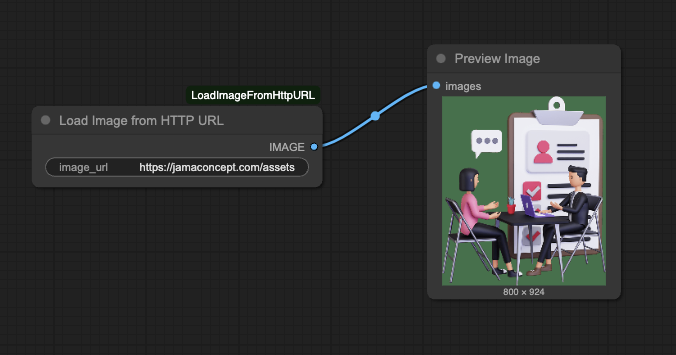

# ComfyUI_LoadImageFromHttpURL
### 🧩 Load Image from HTTP URL – Custom Node for ComfyUI
By @jerrywap
[](https://github.com/jerrywap/ComfyUI_LoadImageFromHttpURL/stargazers)




---

## 🔍 Description

**Load Image from HTTP URL** is a lightweight but powerful custom node for ComfyUI that allows you to **fetch images directly from a remote URL** and use them in your workflows without manual uploads or preprocessing.

Instead of uploading an image file manually, you can pass a publicly accessible image URL — and the node will handle downloading, decoding, and converting it into an image tensor compatible with ComfyUI.

This is especially useful when you're:
- ⚙️ Building **ComfyUI as an API service**
- 📡 Receiving image URLs from client apps, webhooks, or JSON payloads
- 🌐 Working with **dynamic content** from external APIs or cloud storage

By skipping the file transfer step, you reduce friction, improve performance, and make your workflows more automation-friendly.


---

## ✨ Features

- 📡 Downloads an image from an HTTP/HTTPS URL
- 📷 Converts it to a proper image tensor (`IMAGE`) for ComfyUI
- 🧼 Includes graceful fallback (returns a blank black image on error)
- ✅ Supports JPEG, PNG, WebP, etc. (any format supported by Pillow)

---

## 🧩 Node Info

- **Name:** `Load Image from HTTP URL`
- **Class:** `LoadImageFromHttpURL`
- **Category:** `jerrywap/loaders`
- **Input:**
  - `image_url` (STRING): Image address (e.g. https://placehold.co/400)
- **Output:**
  - `IMAGE`: ComfyUI image tensor

---


## 🔧 Installation

1. Clone this repo into your `ComfyUI/custom_nodes` directory:

```
cd /workspace/ComfyUI/custom_nodes
git clone https://github.com/yourusername/ComfyUI_LoadImageFromHttpURL.git
cd ComfyUI_LoadImageFromHttpURL
```

2. Install dependencies:

This node requires the following Python packages:

- `requests`
- `Pillow`
- `numpy`
- `torch`

If you're not sure whether you have them installed, you can simply run:

```
bash install.sh
```

Or, alternatively:

```
pip install -r requirements.txt
```

> ✅ **Note:** If you already have these packages installed (e.g., through your ComfyUI or Python environment), you **do not need to run** the installation steps.

3. Restart ComfyUI or click the **Reload Custom Nodes** button in the UI (if available).

---

## 📤 Example Usage

Use this node to pull images from:
- Web apps or APIs
- Unsplash/image hosting services
- Placeholder tools

Example input:
```
https://placehold.co/400
```

---

## 🧑‍💻 Contributing

Contributions welcome! Submit a PR or open an issue if you’d like to improve this.

---

## 📄 License

MIT License — free to use, modify, and distribute.

[](https://github.com/jerrywap/ComfyUI_LoadImageFromHttpURL/stargazers)
